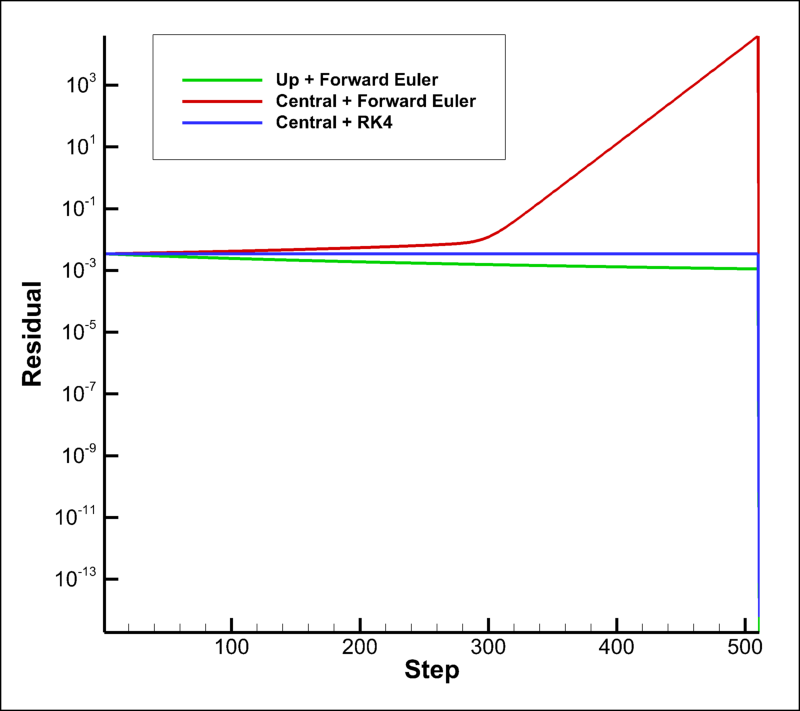

# 2D Linear Advection Solver – RK4 Extension

This branch extends the base solver to include higher-order numerical methods for solving the 2D linear advection equation.

## Overview

The solver computes the time evolution of a scalar field governed by:

∂u/∂t + a ∂u/∂x + b ∂u/∂y = 0

using a structured Cartesian grid.

---

## Numerical Methods

### Spatial Discretization
- First-order upwind scheme (baseline)
- Second-order central difference scheme

### Time Integration
- Forward Euler (explicit, first-order)
- Runge–Kutta 4 (RK4, fourth-order)

---

## Key Feature of This Branch

This branch introduces:

- **Second-order central differencing + RK4**
- Improved stability for advection problems
- Reduced numerical diffusion compared to upwind schemes

---

## Stability Comparison

The following plot compares residual behavior for different schemes:

- Upwind + Forward Euler → stable but diffusive  
- Central + Forward Euler → unstable (residual growth)  
- Central + RK4 → stable and non-dissipative  



---

## Results Interpretation

- **Upwind + Euler**: Residual decreases due to numerical diffusion  
- **Central + Euler**: Residual grows → unstable scheme  
- **Central + RK4**: Residual remains bounded → stable for wave transport  

---

## Output Files

- `solution_RK4_*.dat` → transient solution snapshots  
- `residual_RK4.dat` → residual history  

---

## How to Run

```bash
g++ -std=c++17 -O2 main_time_loop.cpp -o solver.exe
./solver.exe